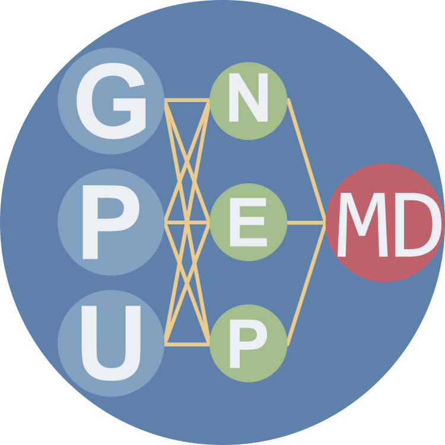

# `GPUMD`

Copyright (2017) Zheyong Fan.
This is the GPUMD software package.
This software is distributed under the GNU General Public License (GPL) version 3.

## What is `GPUMD`?

* `GPUMD` stands for Graphics Processing Units Molecular Dynamics.
* `GPUMD` is a highly efficient general-purpose molecular dynamics (MD) package fully implemented on graphics processing units (GPUs).
* `GPUMD` enables training and using a class of machine-learned potentials (MLPs) called neuroevolution potentials (NEPs). See this [nep-data Gitlab repo](https://gitlab.com/brucefan1983/nep-data) for some of the published NEP potentials and the related training/testing data.

## Prerequisites

* You need to have a GPU card with compute capability no less than 3.5 and a `CUDA` toolkit no older than `CUDA` 9.0.
* Works for both Linux (with GCC) and Windows (with MSVC) operating systems. 

## Compile GPUMD
* Go to the `src` directory and type `make`.
* When the compilation finishes, two executables, `gpumd` and `nep`, will be generated in the `src` directory. 

## Run GPUMD
* Go to the directory of an example and type one of the following commands:
  * `path/to/gpumd`
  * `path/to/nep`

## Colab tutorial
* We provide a [Colab Tutorial](https://colab.research.google.com/drive/1QnXAveZgzwut4Mvldsw-r2I0EWIsj1KA?usp=sharing) to show the workflow of the construction of a NEP model and its application in large-scale atomistic simulations for PbTe system. This will run entirely on Google's cloud virtual machine.
* You can also check other offline tutorials in the examples.

## Manual
* For users and developers:
  * Latest released version: https://gpumd.org/
  * Development version: https://gpumd.org/dev/
* For developers only:
  * [The developer guide](developers)

## Tools

Various tools for `GPUMD` and `NEP` can be found in [tools](./tools/readme.md).

## CPU version of NEP
We also provide an interface for [LAMMPS](https://github.com/lammps/lammps), allowing users to utilize NEP on CPUs via [NEP_CPU](https://github.com/brucefan1983/NEP_CPU).

## Citations

| Reference             | cite for what?                    |
| --------------------- | --------------------------------- |
| [1]                   | for any work that used `GPUMD`   |
| [2-3]                 | virial and heat current formulation   |
| [4]                   | in-out decomposition and related spectral decomposition  |
| [5,3]                 | HNEMD and related spectral decomposition   |
| [6]                   | force constant potential (FCP) |
| [7]                   | neuroevolution potential (NEP) and specifically NEP1 |
| [8]                   | NEP2 |
| [9]                   | NEP3 |
| [10]                  | NEP + ZBL |
| [11]                  | NEP + D3 dispersion correction |
| [12]                  | MSST integrator for shock wave simulation |
| [13]                  | linear-scaling quantum transport |
| [14]                  | NEP4 or UNEP-v1 (General-purpose machine-learned potential for 16 elemental metals and their alloys)|
| [15]                  | TNEP (tensorial NEP models of dipole and polarizability) |
| [16]                  | MCMD (hybrid Monte Carlo and molecular dynamics simulations) |
| [17]                  | PIMD/TRPMD (path-integral molecular dynamics/thermostatted ring-polymer molecular dynamics) |

## References

[1] Zheyong Fan, Wei Chen, Ville Vierimaa, and Ari Harju. [Efficient molecular dynamics simulations with many-body potentials on graphics processing units](https://doi.org/10.1016/j.cpc.2017.05.003), Computer Physics Communications **218**, 10 (2017). 

[2] Zheyong Fan, Luiz Felipe C. Pereira, Hui-Qiong Wang, Jin-Cheng Zheng, Davide Donadio, and Ari Harju. [Force and heat current formulas for many-body potentials in molecular dynamics simulations with applications to thermal conductivity calculations](https://doi.org/10.1103/PhysRevB.92.094301), Phys. Rev. B **92**, 094301, (2015). 

[3] Alexander J. Gabourie, Zheyong Fan, Tapio Ala-Nissila, Eric Pop,
[Spectral Decomposition of Thermal Conductivity: Comparing Velocity Decomposition Methods in Homogeneous Molecular Dynamics Simulations](https://doi.org/10.1103/PhysRevB.103.205421),
Phys. Rev. B **103**, 205421 (2021).

[4] Zheyong Fan, Luiz Felipe C. Pereira, Petri Hirvonen, Mikko M. Ervasti, Ken R. Elder, Davide Donadio, Tapio Ala-Nissila, and Ari Harju. [Thermal conductivity decomposition in two-dimensional materials: Application to graphene](https://doi.org/10.1103/PhysRevB.95.144309), Phys. Rev. B **95**, 144309, (2017).  

[5] Zheyong Fan, Haikuan Dong, Ari Harju, and Tapio Ala-Nissila, [Homogeneous nonequilibrium molecular dynamics method for heat transport and spectral decomposition with many-body potentials](https://doi.org/10.1103/PhysRevB.99.064308), Phys. Rev. B **99**, 064308 (2019). 

[6] Joakim Brorsson, Arsalan Hashemi, Zheyong Fan, Erik Fransson, Fredrik Eriksson, Tapio Ala-Nissila, Arkady V. Krasheninnikov, Hannu-Pekka Komsa, Paul Erhart, [Efficient calculation of the lattice thermal conductivity by atomistic simulations with ab-initio accuracy]( https://doi.org/10.1002/adts.202100217), Advanced Theory and Simulations **4**, 2100217 (2021). 

[7] Zheyong Fan, Zezhu Zeng, Cunzhi Zhang, Yanzhou Wang, Keke Song, Haikuan Dong, Yue Chen, and Tapio Ala-Nissila, [Neuroevolution machine learning potentials: Combining high accuracy and low cost in atomistic simulations and application to heat transport](https://doi.org/10.1103/PhysRevB.104.104309), Phys. Rev. B. **104**, 104309 (2021).

[8] Zheyong Fan, [Improving the accuracy of the neuroevolution machine learning potentials for multi-component systems](https://iopscience.iop.org/article/10.1088/1361-648X/ac462b), Journal of Physics: Condensed Matter **34**, 125902 (2022).

[9] Zheyong Fan, Yanzhou Wang, Penghua Ying, Keke Song, Junjie Wang, Yong Wang, Zezhu Zeng, Ke Xu, Eric Lindgren, J. Magnus Rahm, Alexander J. Gabourie, Jiahui Liu, Haikuan Dong, Jianyang Wu, Yue Chen, Zheng Zhong, Jian Sun, Paul Erhart, Yanjing Su, Tapio Ala-Nissila,
[GPUMD: A package for constructing accurate machine-learned potentials and performing highly efficient atomistic simulations](https://doi.org/10.1063/5.0106617), The Journal of Chemical Physics **157**, 114801 (2022).

[10] Jiahui Liu, Jesper Byggmästar, Zheyong Fan, Ping Qian, and Yanjing Su,
[Large-scale machine-learning molecular dynamics simulation of primary radiation damage in tungsten](https://doi.org/10.1103/PhysRevB.108.054312),
Phys. Rev. B **108**, 054312 (2023).

[11] Penghua Ying and Zheyong Fan,
[Combining the D3 dispersion correction with the neuroevolution machine-learned potential](https://doi.org/10.1088/1361-648X/ad1278),
Journal of Physics: Condensed Matter **36**, 125901 (2024).

[12] Jiuyang Shi, Zhixing Liang, Junjie Wang, Shuning Pan, Chi Ding, Yong Wang, Hui-Tian Wang, Dingyu Xing, and Jian Sun,
[Double-Shock Compression Pathways from Diamond to BC8 Carbon](https://doi.org/10.1103/PhysRevLett.131.146101),
Phys. Rev. Lett. **131**, 146101 (2023).

[13] Zheyong Fan, Yang Xiao, Yanzhou Wang, Penghua Ying, Shunda Chen, and Haikuan Dong,
[Combining linear-scaling quantum transport and machine-learning molecular dynamics to study thermal and electronic transports in complex materials](https://doi.org/10.1088/1361-648X/ad31c2),
Journal of Physics: Condensed Matter **36**, 245901 (2024).

[14] Keke Song, Rui Zhao, Jiahui Liu, Yanzhou Wang, Eric Lindgren, Yong Wang, Shunda Chen, Ke Xu, Ting Liang, Penghua Ying, Nan Xu, Zhiqiang Zhao, Jiuyang Shi, Junjie Wang, Shuang Lyu, Zezhu Zeng, Shirong Liang, Haikuan Dong, Ligang Sun, Yue Chen, Zhuhua Zhang, Wanlin Guo, Ping Qian, Jian Sun, Paul Erhart, Tapio Ala-Nissila, Yanjing Su, Zheyong Fan,
[General-purpose machine-learned potential for 16 elemental metals and their alloys](https://doi.org/10.1038/s41467-024-54554-x),
Nature Communications **15**, 10208 (2024).

[15] Nan Xu, Petter Rosander, Christian Schäfer, Eric Lindgren, Nicklas Österbacka, Mandi Fang, Wei Chen, Yi He, Zheyong Fan, Paul Erhart,
[Tensorial properties via the neuroevolution potential framework: Fast simulation of infrared and Raman spectra](https://doi.org/10.1021/acs.jctc.3c01343),
J. Chem. Theory Comput. **20**, 3273 (2024).

[16] Keke Song, Jiahui Liu, Shunda Chen, Zheyong Fan, Yanjing Su, Ping Qian, [Solute segregation in polycrystalline aluminum from hybrid Monte Carlo and molecular dynamics simulations with a unified neuroevolution potential](https://arxiv.org/abs/2404.13694),
arXiv:2404.13694 [cond-mat.mtrl-sci]

[17] Penghua Ying, Wenjiang Zhou, Lucas Svensson, Esmée Berger, Erik Fransson, Fredrik Eriksson, Ke Xu, Ting Liang, Jianbin Xu, Bai Song, Shunda Chen, Paul Erhart, Zheyong Fan, [Highly efficient path-integral molecular dynamics simulations with GPUMD using neuroevolution potentials: Case studies on thermal properties of materials](https://arxiv.org/abs/2409.04430),
arXiv:2409.04430 [cond-mat.mtrl-sci]
