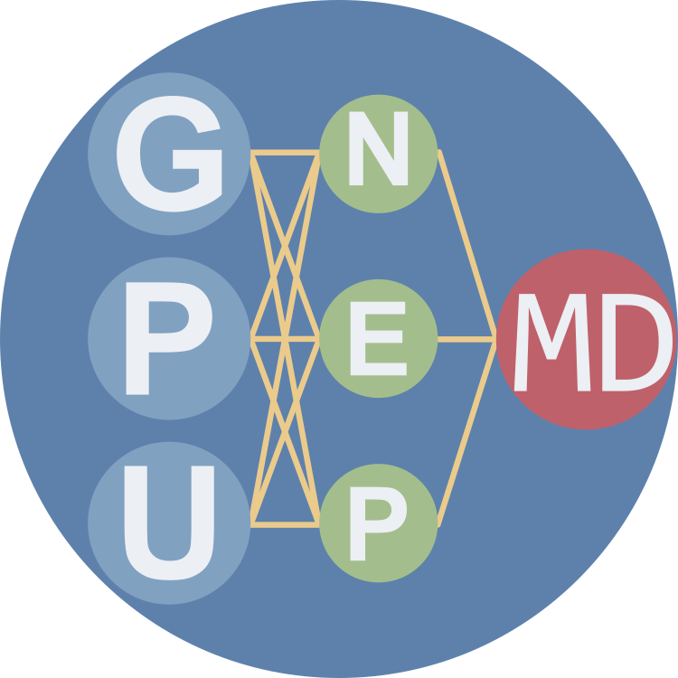

<div align="left">

</div>

# GPUMD

**Graphics Processing Units Molecular Dynamics**

GPUMD is a high-performance, general-purpose molecular dynamics package implemented on GPUs. It supports empirical interatomic potentials and neuroevolution potentials (NEPs), and provides tools for training NEP models and using them in atomistic simulations.

[User manual](https://gpumd.org/) · [Development manual](https://gpumd.org/dev/) · [Examples](https://github.com/brucefan1983/GPUMD/blob/master/examples/readme.md) · [Tutorials](https://github.com/brucefan1983/GPUMD-Tutorials) · [Tools](https://github.com/brucefan1983/GPUMD/blob/master/tools/readme.md) · [Citations](#citations)

## Programs

| Executable | Purpose | Main input files |
| --- | --- | --- |
| `gpumd` | Molecular dynamics simulations and static calculations with empirical or NEP models. | `run.in`, `model.xyz`, and the specified potential files. |
| `nep` | Training and prediction with NEP models. | `nep.in` and datasets such as `train.xyz`. |

Applications include heat transport, thermodynamic and mechanical properties, lattice dynamics, shock compression, path-integral molecular dynamics, and coarse-grained simulations. See the [manual](https://gpumd.org/dev/) for supported methods and the [citation guide](#citations) for the corresponding publications.

## Quick start

### Prerequisites

For the NVIDIA/CUDA build, you need a CUDA-capable NVIDIA GPU, a compatible NVIDIA driver and CUDA toolkit, a supported host C++ compiler, and GNU Make. Ensure that `nvcc` is available in your command search path. Linux builds use GCC; native Windows builds use MSVC and a compatible version of Make. The shell commands below use Unix syntax.

The GPU architecture, CUDA toolkit, and host compiler must be compatible with one another. Consult the [installation guide](https://gpumd.org/dev/installation.html) for platform-specific instructions and optional build features.

### Compile

Download the source and enter the source directory:

```bash
git clone https://github.com/brucefan1983/GPUMD.git
cd GPUMD/src
```

Before compiling, set `CUDA_ARCH` in [src/makefile](src/makefile) to match your GPU and CUDA toolkit. Then build:

```bash
make
```

This generates `gpumd` and `nep` in `src/`.

Instead of editing the makefile, you can override the architecture on the command line. For example, the following command targets a GPU with compute capability **8.9**:

```bash
make CUDA_ARCH="-arch=sm_89"
```

Replace `sm_89` with the target appropriate for your GPU; see [NVIDIA's compute-capability table](https://developer.nvidia.com/cuda/gpus). After changing the architecture, toolkit, or compiler flags, run `make clean` before rebuilding. Add a bounded parallel option such as `-j4` to compile several files concurrently.

**CUDA compatibility:** the makefile currently defaults to `sm_60`. CUDA 13.0 removed offline compilation and library support for Maxwell, Pascal, and Volta GPUs, so this default cannot be used with CUDA 13.x. Set a supported target for a newer GPU, or use a compatible older toolkit for older hardware. See the [CUDA 13.0 release notes](https://docs.nvidia.com/cuda/archive/13.0.0/cuda-toolkit-release-notes/index.html#deprecated-architectures).

For the CMake build, AMD GPUs through ROCm/HIP, and optional interfaces, follow the [installation guide](https://gpumd.org/dev/installation.html).

### Run a molecular dynamics example

From the repository root (`GPUMD/`), run:

```bash
(cd examples/gpumd_dynamic && ../../src/gpumd)
```

The executable reads `run.in` and `model.xyz` in the working directory. This example uses the supplied model at `examples/nep_train/nep.txt`; keep the example directory structure intact, or update the potential path in `run.in`.

### Train or evaluate a NEP model

From the repository root, run the PbTe training example:

```bash
(cd examples/nep_train && ../../src/nep)
```

To evaluate the dataset in the separate prediction example:

```bash
(cd examples/nep_prediction && ../../src/nep)
```

These examples read their own `nep.in` files. Input formats, training options, and outputs are described in the [NEP manual](https://gpumd.org/dev/nep/index.html). Calculations write results into their working directories; save previous results before rerunning an example.

See [examples/readme.md](https://github.com/brucefan1983/GPUMD/blob/master/examples/readme.md) for additional examples and GPU-selection guidance. On a workstation, `CUDA_VISIBLE_DEVICES` can restrict visible GPUs. On a cluster, follow the GPU allocation and environment provided by the job scheduler.

## Documentation and tutorials

| Resource | What it provides |
| --- | --- |
| [Released-version manual](https://gpumd.org/) | Documentation for the latest released version. |
| [Development manual](https://gpumd.org/dev/) | Documentation for the development version; use this when working with `master`. |
| [GPUMD-Tutorials](https://github.com/brucefan1983/GPUMD-Tutorials) | Worked examples of GPUMD applications and related tools. |
| [Colab tutorial](https://colab.research.google.com/drive/1QnXAveZgzwut4Mvldsw-r2I0EWIsj1KA?usp=sharing) | A PbTe workflow covering NEP construction and atomistic simulations in Google Colab. |
| [Developer guide](developers/) | Guidance for working on the GPUMD source code. |

## Potentials and datasets

Published NEP models and their associated training and testing data are available in the [nep-data repository](https://gitlab.com/brucefan1983/nep-data). Additional potential files are provided in [potentials/](potentials/).

Check each model's documentation, intended application range, and citation requirements before using it. A model's coverage of particular elements does not by itself establish accuracy for every structure or thermodynamic condition involving those elements.

## Tools

The [tools directory](https://github.com/brucefan1983/GPUMD/blob/master/tools/readme.md) contains auxiliary scripts for format conversion, structure preparation, dataset processing, and analysis. Its README also lists separately maintained packages related to GPUMD and NEP. Consult each tool's or package's documentation for dependencies, compatibility, and usage instructions.

## CPU version of NEP

[NEP_CPU](https://github.com/brucefan1983/NEP_CPU) provides a standalone C++ implementation for evaluating NEP models on CPUs. It serves as the computational engine for several Python packages and includes an interface to [LAMMPS](https://github.com/lammps/lammps).

NEP_CPU is a separate project, not a CPU build of the full GPUMD simulation package. Consult its documentation for supported NEP model variants and installation instructions.

## Support and contributions

Use [GitHub Discussions](https://github.com/brucefan1983/GPUMD/discussions) or the [GPUMD forum on matsci.org](https://matsci.org/c/gpumd/68) for usage questions and scientific discussions. Report reproducible software problems through [GitHub Issues](https://github.com/brucefan1983/GPUMD/issues).

For a bug report, include the GPUMD version or commit, operating system, GPU model, toolkit and compiler versions, relevant input files, and the error output. A small reproducing example helps isolate the problem.

Code, documentation, examples, and updates to the package list in `tools/readme.md` are welcome through pull requests. Consult the [developer guide](developers/) before making substantial code changes.

## Citations

For work using GPUMD, please cite **[Xu2025](https://doi.org/10.1002/mgea.70028)**. In addition, cite the papers relevant to the potentials and methods used in your work. The table below links directly to each publication; full references are provided in the expandable section.

| Reference | Cite when using |
| --- | --- |
| [Xu2025](https://doi.org/10.1002/mgea.70028) | Any work using GPUMD. |
| [Fan2017a](https://doi.org/10.1016/j.cpc.2017.05.003) | The original GPUMD implementation (historical reference). |
| [Fan2015](https://doi.org/10.1103/PhysRevB.92.094301) | Virial and heat-current formulations for many-body potentials. |
| [Fan2017b](https://doi.org/10.1103/PhysRevB.95.144309) | In-plane/out-of-plane decomposition and related spectral decomposition. |
| [Fan2019](https://doi.org/10.1103/PhysRevB.99.064308) | Homogeneous nonequilibrium MD (HNEMD) and related spectral decomposition. |
| [Gabourie2021](https://doi.org/10.1103/PhysRevB.103.205421) | Equilibrium MD (EMD) and HNEMD-based modal analyses. |
| [Brorsson2021](https://doi.org/10.1002/adts.202100217) | Force constant potential (FCP). |
| [Fan2021](https://doi.org/10.1103/PhysRevB.104.104309) | The NEP framework and NEP1. |
| [Fan2022JPCM](https://doi.org/10.1088/1361-648X/ac462b) | NEP2. |
| [Fan2022JCP](https://doi.org/10.1063/5.0106617) | NEP3. |
| [Liu2023](https://doi.org/10.1103/PhysRevB.108.054312) | NEP with ZBL short-range repulsion. |
| [Ying2024](https://doi.org/10.1088/1361-648X/ad1278) | NEP with D3 dispersion correction. |
| [Shi2023](https://doi.org/10.1103/PhysRevLett.131.146101) | MSST integrator for shock-wave simulations. |
| [Fan2024](https://doi.org/10.1088/1361-648X/ad31c2) | Linear-scaling quantum transport. |
| [Song2024](https://doi.org/10.1038/s41467-024-54554-x) | NEP4 or UNEP-v1 for 16 elemental metals and their alloys. |
| [Xu2024](https://doi.org/10.1021/acs.jctc.3c01343) | Tensorial NEP (TNEP) models of dipole and polarizability. |
| [Song2026](https://doi.org/10.1002/mgea.70049) | Hybrid Monte Carlo and molecular dynamics (MCMD). |
| [Ying2025](https://doi.org/10.1063/5.0241006) | Path-integral MD (PIMD) and thermostatted ring-polymer MD (TRPMD). |
| [Pan2024](https://doi.org/10.1103/PhysRevB.110.224101) | NEMD and NPHug shock methods. |
| [Jiang2025](https://doi.org/10.1021/acsnano.4c12148) | Hybrid Stillinger-Weber and anisotropic interlayer potential (SW + ILP). |
| [Liang2026](https://doi.org/10.1038/s43588-026-01009-6) | NEP89 for inorganic and organic materials across 89 elements. |
| [Huang2026](https://doi.org/10.1016/j.cpc.2025.109994) | NEP training with analytical gradients. |
| [Fan2026a](https://doi.org/10.1021/acs.jctc.6c00146) | qNEP: NEP with dynamic charges. |
| [Li2025](https://doi.org/10.1038/s41524-025-01849-2) | [CGNEP](https://github.com/lmqnuaa/CGNEP) for mesoscale multilayered graphene. |
| [Fan2026b](https://doi.org/10.1016/j.commt.2026.100055) | NEP-CG and NEP-AACG coarse-grained and multiscale models. |
| [Bu2026](https://doi.org/10.1016/j.jmps.2026.106540) | Hybrid NEP and anisotropic interlayer potential (NEP + ILP). |

## References

<details>
<summary>Expand the complete reference list</summary>

**[Xu2025]** Ke Xu, Hekai Bu, Shuning Pan, Eric Lindgren, Yongchao Wu, Yong Wang, Jiahui Liu, Keke Song, Bin Xu, Yifan Li, Tobias Hainer, Lucas Svensson, Julia Wiktor, Rui Zhao, Hongfu Huang, Cheng Qian, Shuo Zhang, Zezhu Zeng, Bohan Zhang, Benrui Tang, Yang Xiao, Zihan Yan, Jiuyang Shi, Zhixin Liang, Junjie Wang, Ting Liang, Shuo Cao, Yanzhou Wang, Penghua Ying, Nan Xu, Chengbing Chen, Yuwen Zhang, Zherui Chen, Xin Wu, Wenwu Jiang, Esme Berger, Yanlong Li, Shunda Chen, Alexander J. Gabourie, Haikuan Dong, Shiyun Xiong, Ning Wei, Yue Chen, Jianbin Xu, Feng Ding, Zhimei Sun, Tapio Ala-Nissila, Ari Harju, Jincheng Zheng, Pengfei Guan, Paul Erhart, Jian Sun, Wengen Ouyang, Yanjing Su, Zheyong Fan. [GPUMD 4.0: A high-performance molecular dynamics package for versatile materials simulations with machine-learned potentials](https://doi.org/10.1002/mgea.70028). MGE Advances **3**, e70028 (2025).

**[Fan2017a]** Zheyong Fan, Wei Chen, Ville Vierimaa, and Ari Harju. [Efficient molecular dynamics simulations with many-body potentials on graphics processing units](https://doi.org/10.1016/j.cpc.2017.05.003). Computer Physics Communications **218**, 10 (2017).

**[Fan2015]** Zheyong Fan, Luiz Felipe C. Pereira, Hui-Qiong Wang, Jin-Cheng Zheng, Davide Donadio, and Ari Harju. [Force and heat current formulas for many-body potentials in molecular dynamics simulations with applications to thermal conductivity calculations](https://doi.org/10.1103/PhysRevB.92.094301). Phys. Rev. B **92**, 094301 (2015).

**[Fan2017b]** Zheyong Fan, Luiz Felipe C. Pereira, Petri Hirvonen, Mikko M. Ervasti, Ken R. Elder, Davide Donadio, Tapio Ala-Nissila, and Ari Harju. [Thermal conductivity decomposition in two-dimensional materials: Application to graphene](https://doi.org/10.1103/PhysRevB.95.144309). Phys. Rev. B **95**, 144309 (2017).

**[Fan2019]** Zheyong Fan, Haikuan Dong, Ari Harju, and Tapio Ala-Nissila. [Homogeneous nonequilibrium molecular dynamics method for heat transport and spectral decomposition with many-body potentials](https://doi.org/10.1103/PhysRevB.99.064308). Phys. Rev. B **99**, 064308 (2019).

**[Gabourie2021]** Alexander J. Gabourie, Zheyong Fan, Tapio Ala-Nissila, Eric Pop. [Spectral Decomposition of Thermal Conductivity: Comparing Velocity Decomposition Methods in Homogeneous Molecular Dynamics Simulations](https://doi.org/10.1103/PhysRevB.103.205421). Phys. Rev. B **103**, 205421 (2021).

**[Brorsson2021]** Joakim Brorsson, Arsalan Hashemi, Zheyong Fan, Erik Fransson, Fredrik Eriksson, Tapio Ala-Nissila, Arkady V. Krasheninnikov, Hannu-Pekka Komsa, Paul Erhart. [Efficient calculation of the lattice thermal conductivity by atomistic simulations with ab-initio accuracy](https://doi.org/10.1002/adts.202100217). Advanced Theory and Simulations **4**, 2100217 (2021).

**[Fan2021]** Zheyong Fan, Zezhu Zeng, Cunzhi Zhang, Yanzhou Wang, Keke Song, Haikuan Dong, Yue Chen, and Tapio Ala-Nissila. [Neuroevolution machine learning potentials: Combining high accuracy and low cost in atomistic simulations and application to heat transport](https://doi.org/10.1103/PhysRevB.104.104309). Phys. Rev. B **104**, 104309 (2021).

**[Fan2022JPCM]** Zheyong Fan. [Improving the accuracy of the neuroevolution machine learning potentials for multi-component systems](https://doi.org/10.1088/1361-648X/ac462b). Journal of Physics: Condensed Matter **34**, 125902 (2022).

**[Fan2022JCP]** Zheyong Fan, Yanzhou Wang, Penghua Ying, Keke Song, Junjie Wang, Yong Wang, Zezhu Zeng, Ke Xu, Eric Lindgren, J. Magnus Rahm, Alexander J. Gabourie, Jiahui Liu, Haikuan Dong, Jianyang Wu, Yue Chen, Zheng Zhong, Jian Sun, Paul Erhart, Yanjing Su, Tapio Ala-Nissila. [GPUMD: A package for constructing accurate machine-learned potentials and performing highly efficient atomistic simulations](https://doi.org/10.1063/5.0106617). The Journal of Chemical Physics **157**, 114801 (2022).

**[Liu2023]** Jiahui Liu, Jesper Byggmästar, Zheyong Fan, Ping Qian, and Yanjing Su. [Large-scale machine-learning molecular dynamics simulation of primary radiation damage in tungsten](https://doi.org/10.1103/PhysRevB.108.054312). Phys. Rev. B **108**, 054312 (2023).

**[Ying2024]** Penghua Ying and Zheyong Fan. [Combining the D3 dispersion correction with the neuroevolution machine-learned potential](https://doi.org/10.1088/1361-648X/ad1278). Journal of Physics: Condensed Matter **36**, 125901 (2024).

**[Shi2023]** Jiuyang Shi, Zhixing Liang, Junjie Wang, Shuning Pan, Chi Ding, Yong Wang, Hui-Tian Wang, Dingyu Xing, and Jian Sun. [Double-Shock Compression Pathways from Diamond to BC8 Carbon](https://doi.org/10.1103/PhysRevLett.131.146101). Phys. Rev. Lett. **131**, 146101 (2023).

**[Fan2024]** Zheyong Fan, Yang Xiao, Yanzhou Wang, Penghua Ying, Shunda Chen, and Haikuan Dong. [Combining linear-scaling quantum transport and machine-learning molecular dynamics to study thermal and electronic transports in complex materials](https://doi.org/10.1088/1361-648X/ad31c2). Journal of Physics: Condensed Matter **36**, 245901 (2024).

**[Song2024]** Keke Song, Rui Zhao, Jiahui Liu, Yanzhou Wang, Eric Lindgren, Yong Wang, Shunda Chen, Ke Xu, Ting Liang, Penghua Ying, Nan Xu, Zhiqiang Zhao, Jiuyang Shi, Junjie Wang, Shuang Lyu, Zezhu Zeng, Shirong Liang, Haikuan Dong, Ligang Sun, Yue Chen, Zhuhua Zhang, Wanlin Guo, Ping Qian, Jian Sun, Paul Erhart, Tapio Ala-Nissila, Yanjing Su, Zheyong Fan. [General-purpose machine-learned potential for 16 elemental metals and their alloys](https://doi.org/10.1038/s41467-024-54554-x). Nature Communications **15**, 10208 (2024).

**[Xu2024]** Nan Xu, Petter Rosander, Christian Schäfer, Eric Lindgren, Nicklas Österbacka, Mandi Fang, Wei Chen, Yi He, Zheyong Fan, Paul Erhart. [Tensorial properties via the neuroevolution potential framework: Fast simulation of infrared and Raman spectra](https://doi.org/10.1021/acs.jctc.3c01343). J. Chem. Theory Comput. **20**, 3273 (2024).

**[Song2026]** Keke Song, Jiahui Liu, Yuanxu Zhu, Shunda Chen, Zheyong Fan, Yanjing Su, Ping Qian. [Solute Segregation in Polycrystalline Aluminum From Hybrid Monte Carlo and Molecular Dynamics Simulations With a Unified Neuroevolution Potential](https://doi.org/10.1002/mgea.70049). Materials Genome Engineering Advances **4**, e70049 (2026).

**[Ying2025]** Penghua Ying, Wenjiang Zhou, Lucas Svensson, Esmée Berger, Erik Fransson, Fredrik Eriksson, Ke Xu, Ting Liang, Jianbin Xu, Bai Song, Shunda Chen, Paul Erhart, Zheyong Fan. [Highly efficient path-integral molecular dynamics simulations with GPUMD using neuroevolution potentials: Case studies on thermal properties of materials](https://doi.org/10.1063/5.0241006). J. Chem. Phys. **162**, 064109 (2025).

**[Pan2024]** Shuning Pan, Jiuyang Shi, Zhixin Liang, Cong Liu, Junjie Wang, Yong Wang, Hui-Tian Wang, Dingyu Xing, and Jian Sun. [Shock compression pathways to pyrite silica from machine learning simulations](https://doi.org/10.1103/PhysRevB.110.224101). Phys. Rev. B **110**, 224101 (2024).

**[Jiang2025]** Wenwu Jiang, Ting Liang, Hekai Bu, Jianbin Xu, and Wengen Ouyang. [Moiré-driven interfacial thermal transport in twisted transition metal dichalcogenides](https://doi.org/10.1021/acsnano.4c12148). ACS Nano **19**, 16287 (2025).

**[Liang2026]** Ting Liang, Ke Xu, Eric Lindgren, Zherui Chen, Rui Zhao, Jiahui Liu, Esmée Berger, Benrui Tang, Bohan Zhang, Yanzhou Wang, Keke Song, Penghua Ying, Nan Xu, Haikuan Dong, Shunda Chen, Paul Erhart, Zheyong Fan, Tapio Ala-Nissila, Jianbin Xu. [NEP89: Universal neuroevolution potential for inorganic and organic materials across 89 elements](https://doi.org/10.1038/s43588-026-01009-6). Nature Computational Science **6**, 789 (2026).

**[Huang2026]** Hongfu Huang, Junhao Peng, Kaiqi Li, Jian Zhou, Zhimei Sun. [Efficient GPU-accelerated training of a neuroevolution potential with analytical gradients](https://doi.org/10.1016/j.cpc.2025.109994). Computer Physics Communications **320**, 109994 (2026).

**[Fan2026a]** Zheyong Fan, Benrui Tang, Esmée Berger, Ethan Berger, Erik Fransson, Ke Xu, Zihan Yan, Zhoulin Liu, Zichen Song, Haikuan Dong, Shunda Chen, Lei Li, Ziliang Wang, Yizhou Zhu, Julia Wiktor, Paul Erhart. [qNEP: A highly efficient neuroevolution potential with dynamic charges for large-scale atomistic simulations](https://doi.org/10.1021/acs.jctc.6c00146). J. Chem. Theory Comput. **22**, 4787 (2026).

**[Li2025]** Mingqian Li, Lifeng Wang, Zhuoqun Zheng. [Coarse-grained machine learning potential for mesoscale multilayered graphene](https://doi.org/10.1038/s41524-025-01849-2). npj Computational Materials **11**, 374 (2025).

**[Fan2026b]** Zheyong Fan, Wenjun Zhang, Zhenhao Zhang, Ke Xu, Xuecheng Shao, Haikuan Dong. [NEP-CG and NEP-AACG: Efficient coarse-grained and multiscale all-atom-coarse-grained neuroevolution potentials](https://doi.org/10.1016/j.commt.2026.100055). Computational Materials Today **10**, 100055 (2026).

**[Bu2026]** Hekai Bu, Wenwu Jiang, Penghua Ying, Ting Liang, Zheyong Fan, and Wengen Ouyang. [Modular hybrid machine learning and physics-based potentials for scalable modeling of Van der Waals heterostructures](https://doi.org/10.1016/j.jmps.2026.106540). J. Mech. Phys. Solids **210**, 106540 (2026).

</details>

## License

Copyright (2017) Zheyong Fan. GPUMD is distributed under the GNU General Public License (GPL), version 3. See [LICENCE](LICENCE) for the full license text.
