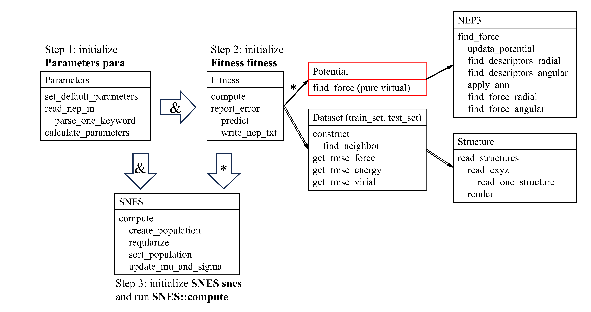

# GPUMD Developer Guide

* This file contains information useful for existing and future `GPUMD` developers.

* You can ignore this file if you are not interested in becoming a developer of `GPUMD`.

* This is a work in progress, which will be constantly updated along with the GPUMD development activities.

## Using git to manage pull request (PR) contributions

* If you are new to this, here is a good place to start reading: https://git-scm.com/book/ms/v2/GitHub-Contributing-to-a-Project

## Development environments

* You can develop `GPUMD` in either Linux or Windows, as long as you have a working CUDA and/or HIP development toolkit, and one or more suitable GPUs (Nvidia or AMD).

* `GPUMD` uses `make` to manage installation (or compilation).
We have not seen the necessity of using `cmake`, yet.

* There is no message passing interface (MPI) support in `GPUMD` yet, so currently you don't need to have MPI.
We might add MPI support in the future.

* To build `GPUMD`, simply type `make` (for the CUDA version) or `make -f makefile.hip` (for the HIP version) and you will get the `gpumd` and `nep` binary files.

## External dependencies

* We make efforts to keep `GPUMD` as independent as possible.
In principle, we only use CUDA C++ and HIP C++ in the source code.
Particularly, we do not use Python in the source code.

* If you want to introduce external dependence, the relevant code must be made optional, which will not be compiled by default.
You also need to give detailed instructions for setting up the necessary tools.

* Currently we have two external dependencies, the `NetCDF` package and the `PLUMED` package.

## Regression tests

* There are a few regression tests in the `tests` folder.

* During the development, please add `-DDEBUG` to the makefile and remove it right before merging the PR. 

* A developer should run the regression tests before starting a PR, saving the output files, and run the regression tests frequently during the creation of the PR.

* Usually, there should be no single change to the output files (using `diff` in Linux or `fc` in Windows to check), but if there are changes, please justify.

## Source files

* All the source code of `GPUMD` can be found in the `src` folder.
They are either a source file with the `.cu` extension or a header file with the `.cuh` extension. 

* The source code was originally written in CUDA C++, but starting from GPUMD-v3.9.6, we support CUDA and HIP simultaneously.
The CUDA and HIP specific APIs are collected in `src/utilities/gpu_macro.cuh`.
If you use new CUDA and HIP APIs, they should be added to this file.

* We use `clang-format` to format all the source and header files, according to the specifications in the file `.clang-format`, which can be found in the main folder of the `GPUMD` package.

## Code structure

* `main_nep`: Starting point for neuroevolution potential (NEP) training.

* `main_gpumd`: Starting point for the `gpumd` executable. It contains the following modules:
  * `model`: The module dealing with the model system in the simulation. This module is used by all the other modules under `main_gpumd`.
  * `force`: The module containing all the potentials.
  * `integrate`: The module containing all the integrators/ensembles.
  * `measure`: The module doing most of the on-the-fly calculations of the physical properties.
  * `phonon`: The module for doing phonon calculations.
  * `minimize`: The module for doing energy minimization.
  * `mc`: The module for doing hybrid Monte Carlo and molecular dynamics (MCMD) simulations.
* `utilities`: The module containing some common utilities used in many of the other modules.

## Class Topology

* To quickly understand software architecture, there are two class topology figures for `gpumd` and `nep`. For each class, the corresponding files are in the `src` folder. For example, you could find class `Atom` in `atom.cu` and `atom.cuh`. In addition to these classes, there is another important class `GPU_Vector`. This class is designed perfectly and handles all data in GPU. The usage of it is almost the same of `std::vector`.
* Meaning of the symbols:
  * Solid lines represent the class at the base of the arrow holds an instance of the class at the tip.
  * Full lines with `*` represent the class at the base of the arrow holds a pointer to an instance of the class at the tip.
  * Dashed lines represent the class at the tip of the arrow is derived from the class at the base.
  * Double solid lines represent the class at the base of arrow holds a vector of the class at the tip.
  * Red boundaries represent these classes have pure virtual functions so that couldn't be instantiated directly.
  * The shape of boundary represents the "level" of this class to make the figure
* The topmost class of `gpumd` is `Run`, which holds all core class instances except `Minimize`. Class `Minimize` will be instantiated just when `minimize` is setting.

* More details about `gpumd` class topology:
  * `Run` holds a vector of `Group` instances that each represents a group method.
  * `thermo` is a `std::vector` of `float` in the class `Run`.

* The classes in `nep` is simpler so here we list some main functions to make the training process clearer. There are just three main steps in the figure.
  * Step 1: initialize `para` by parameters set in `nep.in` file.
  * Step 2: initialize `fitness` by a reference of `para` and read `train.xyz` and `test.xyz` (if exist) to initialize two datasets.
  * Step 3: initialize `snes` by `para` and `fitness`. At the end of construct function, `SNES::compute` is called to start the training. 

## Units

* Units for inputs and outputs should be specified in the user manual.

* Internally, we use the following basic units:
  * Energy: eV
  * Legnth: Angstrom
  * Mass: Dalton
  * Temperature: K
  * Charge: e (proton charge)

  
