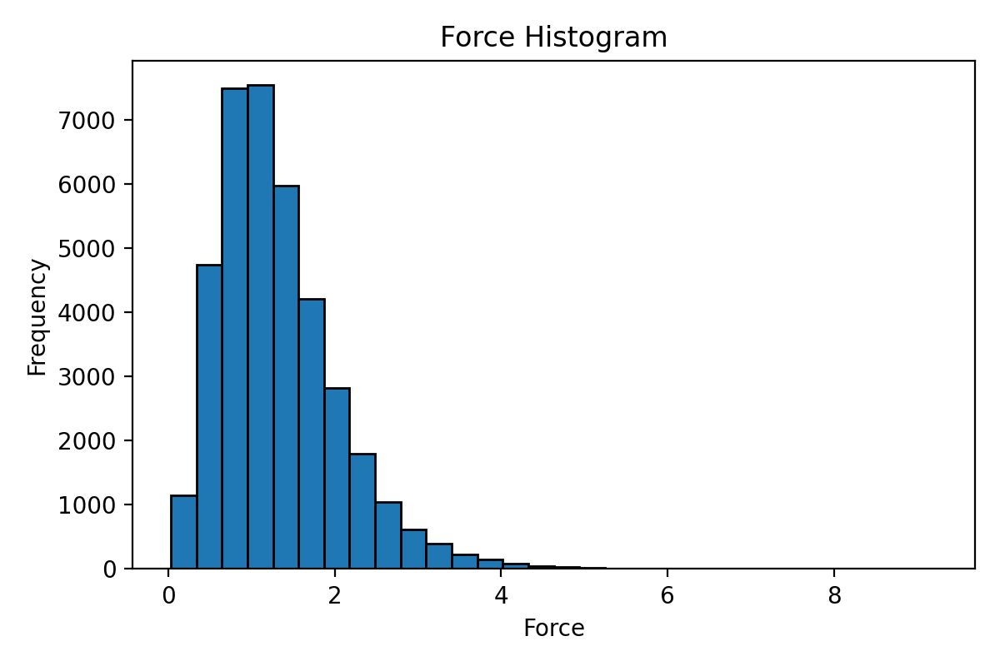

### energy_force_virial_analyzer.py

---

This script calculates and visualizes the range of properties (such as energy, forces, and virial) from the `extxyz` file.

#### Usage

The script requires at least two arguments:

- The filename of the `extxyz` file.
- The name of the property to analyze (`energy`, `force`, or `virial`).

An optional third argument (`hist`) can be provided to generate a histogram plot of the values.

```
python script.py <filename> <property> [hist]
```

#### Example1

```sh
python energy_force_virial_analyzer.py dump.xyz force
```

#### Output

```
Force range: 0.03210566767721861 to 9.230115912468435
```

If you add the `[hist]` option, it will calculate the range of forces and display a histogram:

```sh
python energy_force_virial_analyzer.py dump.xyz force hist
```




### get_min_dist.py

---

This script is used to calculate the min_dist of the structures.

#### Usage

```
python get_min_dist.py <extxyz_file>
```

#### Example

```sh
python get_min_dist.py dump.xyz
```

#### Output

```
Minimum interatomic distance: 1.478098603206159 Å
```

NOTE: This script seems to be buggy and still needs improvement.


### filter_exyz_by_value.py

---

This script filter the structures by min_dist.

#### Usage

```sh
python filter_exyz_by_value.py <extxyz_file> <min_dist>
```

#### Example

```sh
python filter_exyz_by_value.py dump.xyz 1.4
```


### filter_exyz_by_box.py

---

This script filter the structures by box limit.

#### Usage

```
python filter_exyz_by_box.py <extxyz_file> <min_dist>
```

#### Example

```
python filter_exyz_by_box.py dump.xyz 20
```


### filter_exyz_by_value.py

---

This script filter the structures by specified value.

#### Usage

```
python filter_exyz_by_value.py <extxyz_file> <property> <threshold>
```

- `<extxyz_file>`: The path to the input `extxyz` file.
- `<property>`: Filtering property: `energy`, `force`, or `virial`
- `<threshold>`: Threshold value for filtering

#### Example

```
python filter_exyz_by_value.py train.xyz force 20
```

This command will filter out the structure in `train.xyz` with a force greater than 20 eV/angstrom.


---

Thank you for using `GPUMDkit`! If you have any questions or need further assistance, feel free to open an issue on our GitHub repository or contact Zihan YAN (yanzihan@westlake.edu.cn).
