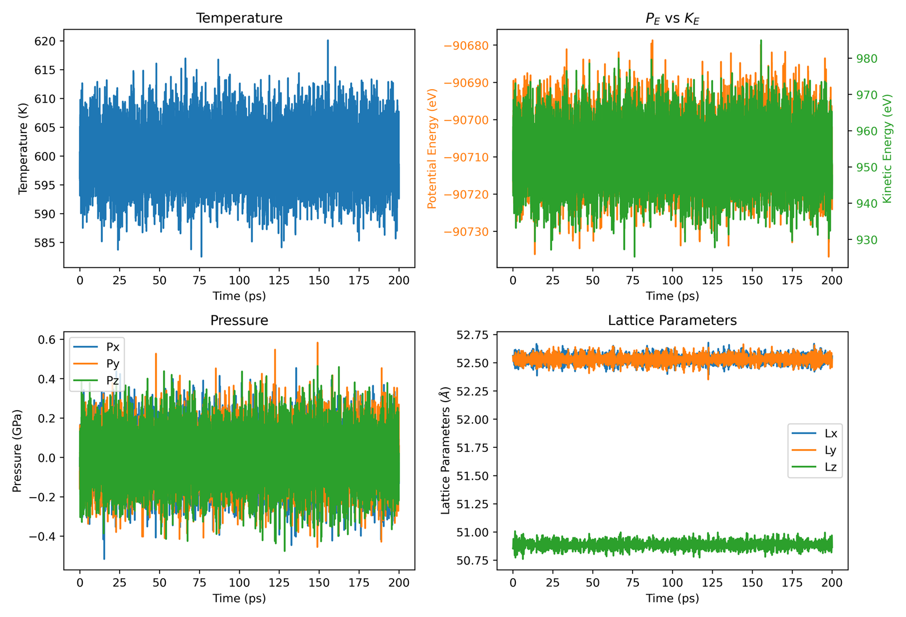
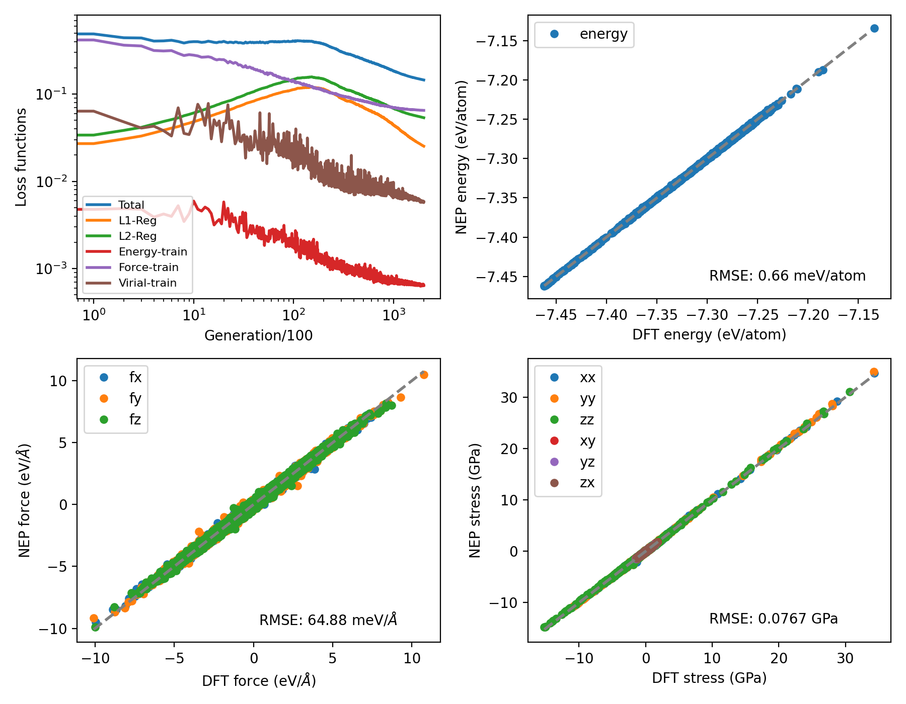
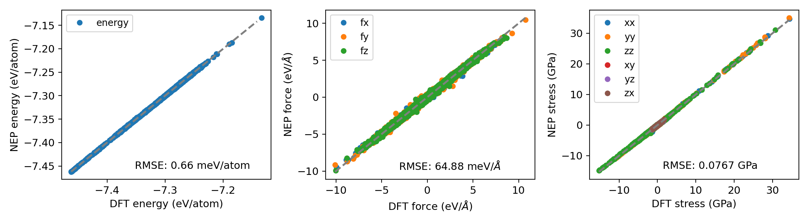
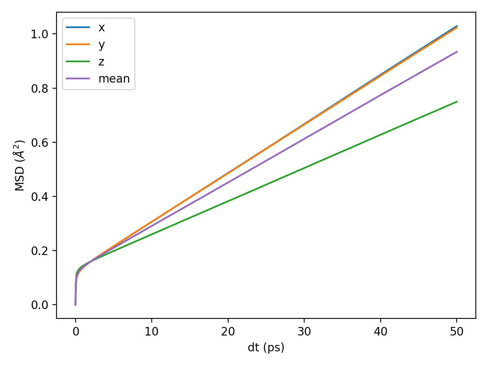

## Plot Scripts

This folder contains Python scripts for visualization of data generated by `GPUMD` and `NEP`.

- `plt_nep_thermo.py`: Python script to visualize temperature, kinetic energy, potential energy, pressure, and lattice evolution over simulation time based on data from `thermo.out`.

  

- `plt_nep_train_results.py`: Python script to visualize parameters during `NEP` training and comparison of `DFT` and `NEP` predictions for `energy`, `force`, `stress`, etc.

  

- `plt_nep_prediction_results.py`: Python script to visualize predictions during the `NEP` prediction process.

  

- `plt_msd.py`: Python script to visualize the MSD from `msd.out` file.

  

  - `thermo.png`, `train.png`, `prediction.png`,`msd.png`: Example output plots generated by the scripts.


#### Usage:

You can use `gpumdkit.sh` for simplified execution:

```bash
gpumdkit.sh -plt thermo/train/prediction/msd/vac [save]
```

Replace `thermo`, `train`, `prediction`, `msd`, `vac` with the desired script keyword.

The optional `save` argument will save the plot as a `PNG` file; omitting it will display the plot using `plt.show()`.

#### Example:

To visualize `thermo` evolution from `thermo.out` :

```sh
gpumdkit.sh -plt thermo
```

To save the plot of `thermo` evolution from `thermo.out` :

```sh
gpumdkit.sh -plt thermo save
```


---

Thank you for using `GPUMDkit`! If you have any questions or need further assistance, feel free to open an issue on our GitHub repository or contact Zihan YAN (yanzihan@westlake.edu.cn).
